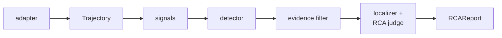

# PROBE

**P**roduction **R**oot-cause **O**bservation & **B**ehavioral **E**valuation — detect, localize, and explain AI-agent failures from production execution traces, without ground-truth trajectories.

[](https://github.com/ritiksharmax/probe/actions/workflows/ci.yml)
[](LICENSE)
[](pyproject.toml)

> [!IMPORTANT]
> **Milestone 1 is built and benchmarked — and the headline result is a negative one.** On the public [AgentRx](https://github.com/microsoft/AgentRx) data, PROBE's evidence filtering does not beat a plain full-trajectory judge on localization; the naive baseline wins. Filtering *is* ~25% cheaper at indistinguishable accuracy, and two of the ordering claims in earlier drafts of these docs were withdrawn after a second run reversed them. Read [Results](#results) before trusting any number below it — this project treats a single benchmark run as a point estimate, not a finding.

## Contents

- [What it does](#what-it-does)
- [Why it is different](#why-it-is-different)
- [Ingestion](#ingestion)
- [Install](#install)
- [Use](#use)
- [Results](#results)
- [Development](#development)
- [License](#license)

## What it does

Point PROBE at an agent trace and it answers three questions:

1. **Did this run fail?** — from cheap, LLM-free signals: tool errors, loops, no-progress windows, refusal phrases, budget anomalies, and declarative policy constraints.
2. **Where did it go wrong?** — the critical step, via a signal-density prior ensembled with an LLM judge.
3. **Why?** — a root cause from a 10-category taxonomy, with supporting evidence and a counterfactual.



## Why it is different

The closest prior work is Microsoft's [AgentRx](https://github.com/microsoft/AgentRx). PROBE targets three gaps in it:

| | AgentRx | PROBE |
|---|---|---|
| **Detection** | Assumes you already know the run failed | Finds failures in the first place, from cheap signals — what production actually needs |
| **Cost** | Judges with GPT-5 over the full trajectory | Filters to a few suspect evidence windows first, so a small local model can attempt the diagnosis |
| **Ingestion** | Benchmark files only | Reads OpenTelemetry GenAI spans (and OpenInference), Langfuse, and LangSmith exports |

The cost claim is measured, not assumed: filtering buys **~25% fewer tokens and no accuracy gain**. It is a cost claim, not a quality one — see [Results](#results).

## Ingestion

| Adapter | Source |
|---|---|
| `jsonl` | PROBE's canonical schema (default) |
| `otel` | OTLP/JSON — OTel GenAI semconv **and** OpenInference attributes |
| `langfuse` | Langfuse trace/observation export |
| `langsmith` | LangSmith run export, including nested `child_runs` |
| `agentrx` | The AgentRx benchmark's τ-retail and Magentic-One formats |

Every adapter emits the same `Trajectory`, with steps **chronological and 1-based** regardless of the order records arrived in.

## Install

```bash
pip install probe-agents                 # import name: probe
pip install "probe-agents[anthropic]"    # + the reference judge tier
```

## Use

```bash
probe detect traces.jsonl                        # triage — no LLM calls
probe analyze traces.jsonl                       # full root-cause reports
probe analyze traces.jsonl --tier small --full   # cheap tier, unfiltered (ablation)
probe bench agentrx --detection-only             # reproduce H1 without model access
```

```python
from probe import read_jsonl
from probe.detect import Detector

detector = Detector()
for trajectory in read_jsonl("traces.jsonl"):
    verdict = detector(trajectory)
    if verdict.failed:
        print(verdict.explain())
```

### Domain constraints

The error- and loop-based signals are structurally blind to a failure that *looks* healthy — every tool call succeeds and the agent quietly does the wrong thing. Constraints close that gap:

```python
from probe.signals import ConstraintSignal, default_signals, require_before

constraints = [
    require_before(
        name="authenticate_first",
        description="Authenticate the user before disclosing order details.",
        prerequisite="find_user_id_by_name_zip",
        dependent="get_order_details",
    ),
]
detector = Detector(signals=[*default_signals(), ConstraintSignal(constraints)])
```

`examples/demo_agent.py` shows the difference this makes: a refund of $200 against a $20 order scores **0.00** with the default battery and **0.90** with constraints, while the healthy run stays at 0.00.

## Results

Measured on the public AgentRx data — 73 trajectories (τ-retail 29, Magentic-One 44). See [`benchmarks/agentrx/README.md`](benchmarks/agentrx/README.md) for full methodology, error bars, and a cross-run comparison tool; it also covers an important scope caveat — the Flash domain is unpublished, so nothing here is the paper's 115-trajectory aggregate.

### Detection (H1)

τ-retail, 29 annotated failures vs 73 successful runs:

| | recall | false-positive rate |
|---|---:|---:|
| hand-set weights | 0.586 | 0.301 |
| calibrated, 5-fold CV | 0.552 | **0.192** |

Calibration cuts false positives by a third. Numbers are cross-validated — a naive-Bayes fit reported on its own training data at n=29 would be meaningless.

### Localization floor

`signals-only`, no LLM:

| | exact | ±1 | ±5 |
|---|---:|---:|---:|
| τ-retail | 0.034 | 0.172 | 0.379 |
| Magentic-One | 0.136 | 0.159 | 0.273 |

On τ-retail this beats the trivial last-step and midpoint baselines at every tolerance. **On Magentic-One it loses to picking the last step** — Magentic trajectories are flat prose with no parsed tool calls, so every tool-level signal is blind there. That is a known gap, not a tuned result.

### Localization and attribution (H2/H3)

3 repeats per configuration, `qwen3-4b-thinking`, pooled over all 73 trajectories:

| system | exact | ±5 | cat(rc) | tokens/diagnosis |
|---|---:|---:|---:|---:|
| `naive-full` | **0.187** | 0.461 | 0.128 | 7,837 |
| `agentrx-style` | 0.128 | **0.466** | 0.132 | 8,226 |
| `filtered-only` | 0.123 | 0.443 | **0.146** | **6,197** |
| `probe` | 0.110 | 0.470 | 0.100 | 7,065 |
| `signals-only` | 0.096 | 0.315 | 0.000 | 0 |

> [!WARNING]
> **PROBE's filtering does not improve localization.** `naive-full` — whole trajectory, no violation log, the baseline all this machinery was supposed to beat — leads exact match by 4–6 trajectories, the only gap here wider than its own spread.
>
> Worse for the rest of the table: two independent 3-repeat runs of the *same* configuration rank the systems differently. `agentrx-style` is first on τ attribution in one run and last in the other. The entire τ attribution field spans one trajectory, so at n=29 those orderings are not measurable at all. An earlier version of these docs claimed the violation log helps attribution; **that is withdrawn.**

What holds up: the judge beats the LLM-free floor mostly on *proximity* (±5 0.470 vs 0.315) rather than precision (exact 0.110 vs 0.096), and filtering is **~25% cheaper** at indistinguishable accuracy. Read that as "the filter is free," not "the filter is better."

## Development

```bash
uv venv && uv pip install -e ".[dev,bench]"
uv run pytest          # 313 tests, fully offline — no network, no API key
uv run ruff check .
uv run python examples/demo_agent.py
```

The test suite never touches the network. Benchmark data is fetched separately and pinned to an upstream commit SHA.

## License

[MIT](LICENSE)
